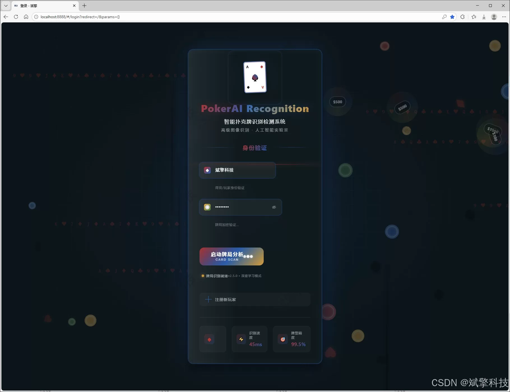
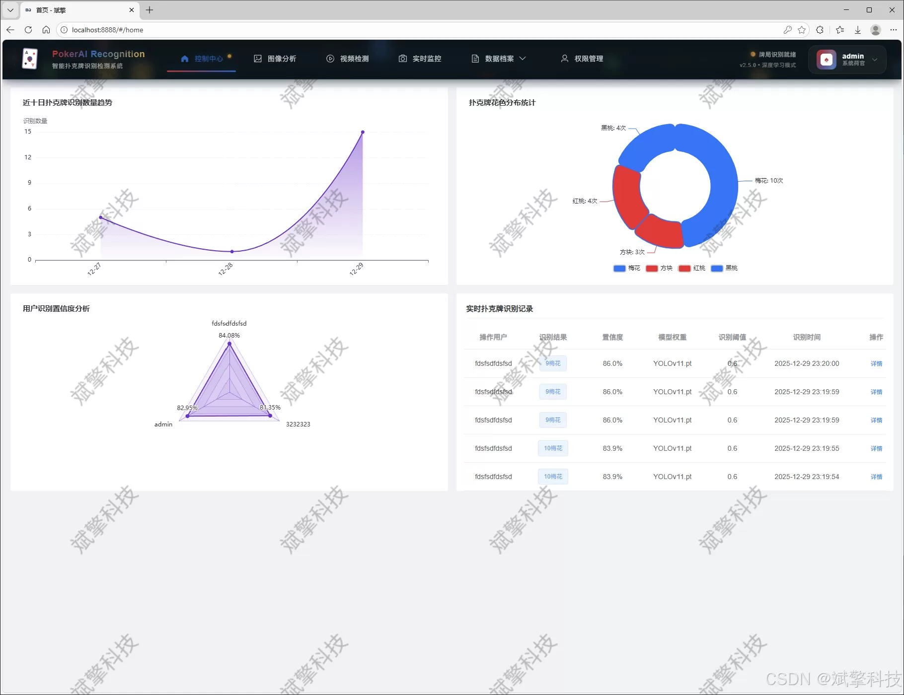
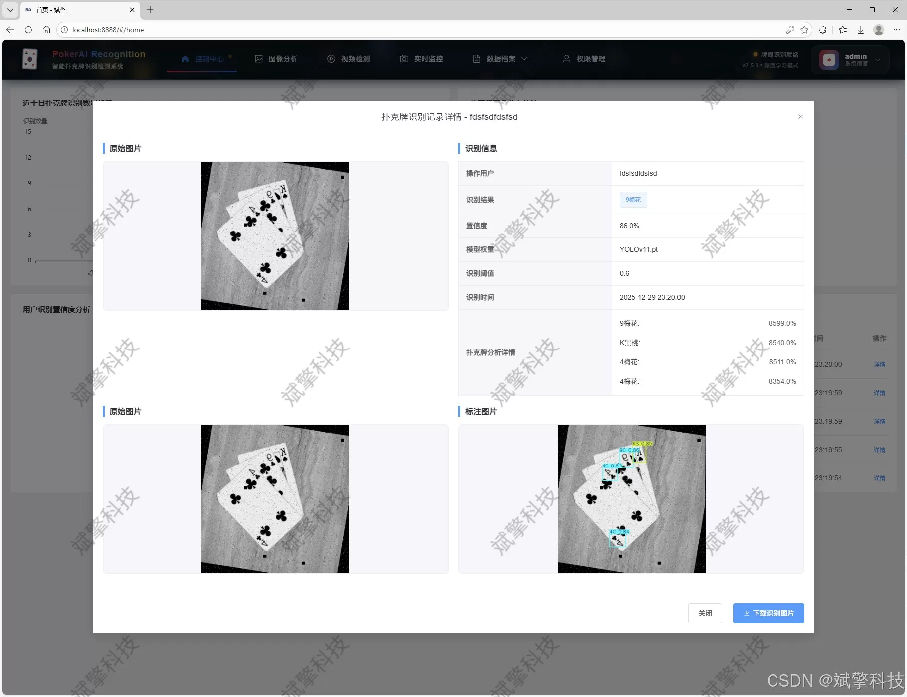
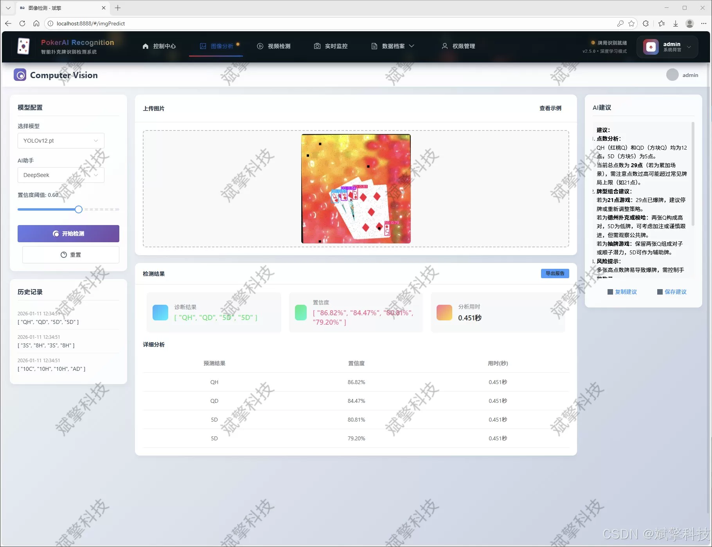
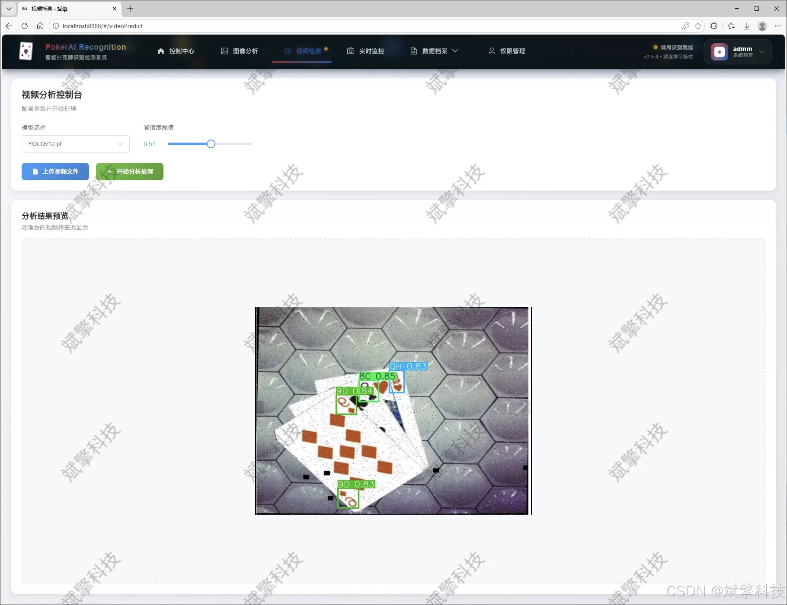
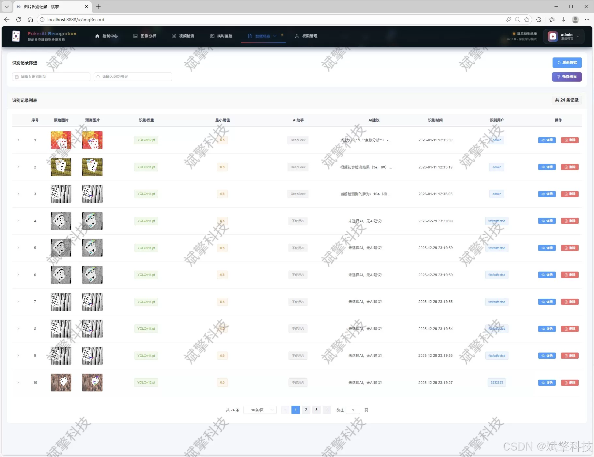
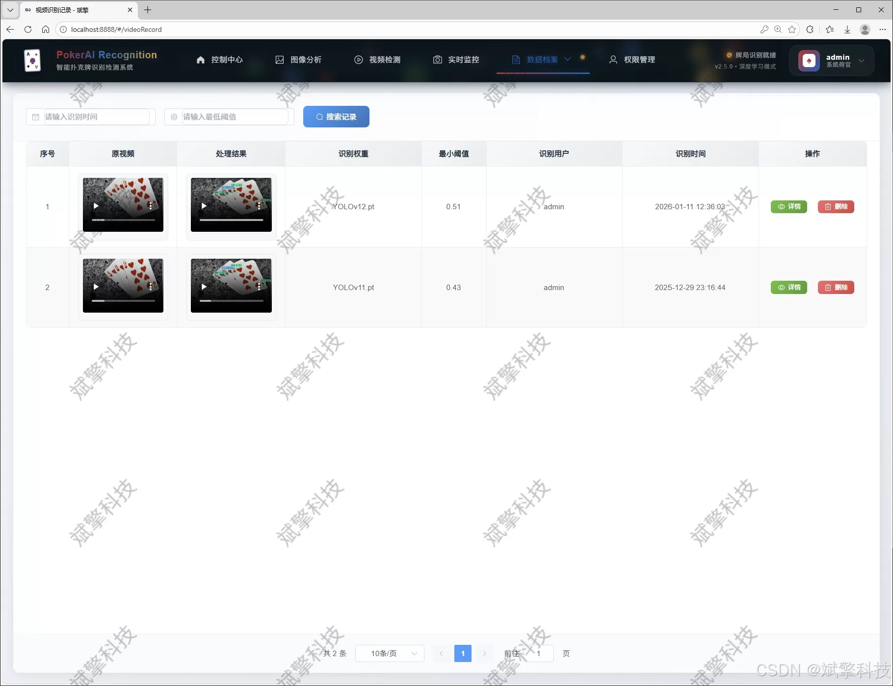
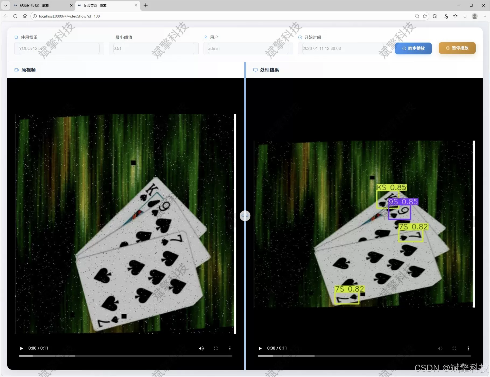
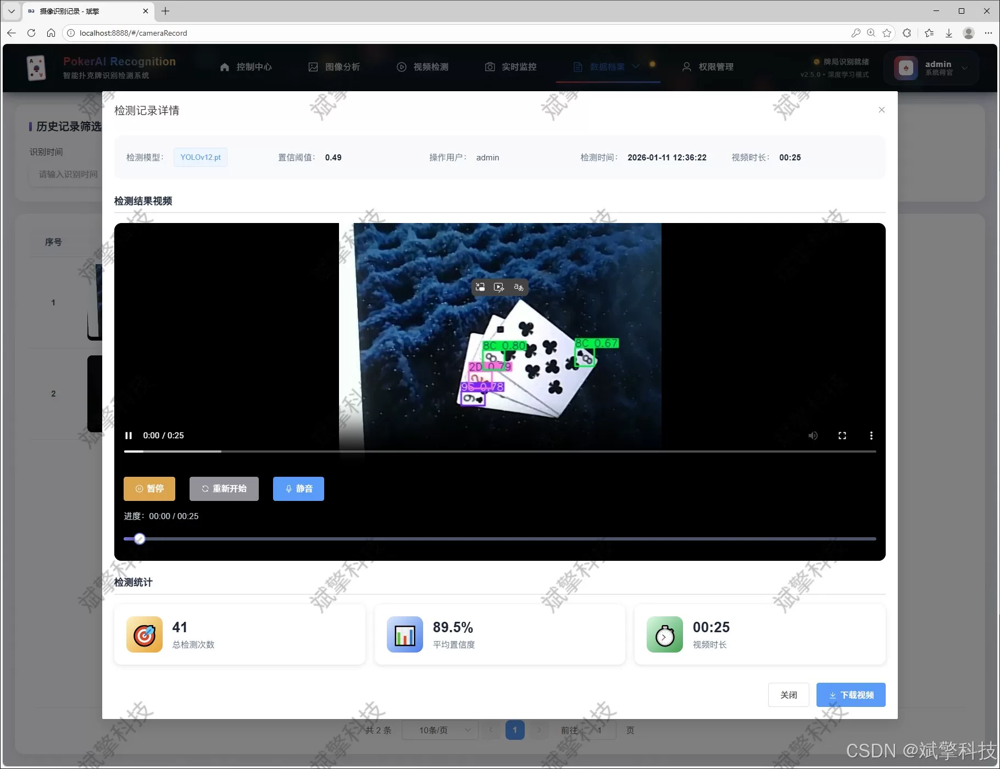

# Based on YOLO deep learning and the big models of Qiwen and DeepSeek for poker card recognition

## Body

Based on YOLO deep learning and the large models of QiQi, a poker card recognition detection system (DeepSeek intelligent analysis + web interface + front-end separation + YOLO data + YOLOv8/YOLOv10/YOLOv11/YOLOv12)

With the rapid development of artificial intelligence and computer vision technology, target detection technology is increasingly applied in fields such as game analysis, security monitoring, and automated settlement. This paper designs and implements a poker card intelligent recognition and management system based on multiple versions of YOLO target detection algorithm and SpringBoot backend framework. The core of the system adopts the current cutting-edge YOLO series models (YOLOv8/v10/v11/v12), trained and optimized on a dataset containing more than 24,000 images of 52 standard poker cards. It achieves high precision multi-category real-time detection of poker cards. The system adopts a front-end-back-end separation architecture, with a user-friendly Web interface provided by the front end and a back end built based on SpringBoot, integrating the intelligent analysis function of DeepSeek big language model to perform semantic interpretation and strategy analysis on detection results. The system has a complete user authentication and management module, supporting real-time detection of images, videos, and camera streams, and storing all detection records and user operations in MySQL database. Test results show that the system not only has high recognition accuracy and fast response speed but also has good scalability and user friendliness, providing a comprehensive and advanced solution for AI applications related to poker cards.

Functional modules

✅ User login registration: Support password verification and save to MySQL database.

✅ Support four YOLO models switching: YOLOv8, YOLOv10, YOLOv11, YOLOv12.

✅ Information visualization, data visualization.

✅ Image detection support AI analysis function, deepseek and QiQi.

✅ Support image detection, video detection and real-time camera detection, detection results saved to MySQL database.

✅ Image recognition record management, video recognition record management and camera recognition record management.

✅ User management module, administrator can add, delete, update, and view users.

✅ Personal center, you can modify your information, password name profile picture etc.

## Images

## Payment

Here is a pay link on Stripe ( https://buy.stripe.com/3cs8yP7sY87d0vu9AB ). Please contact me lonlonago@foxmail.com after funding $89, and I will send you a complete data files , thank you!

